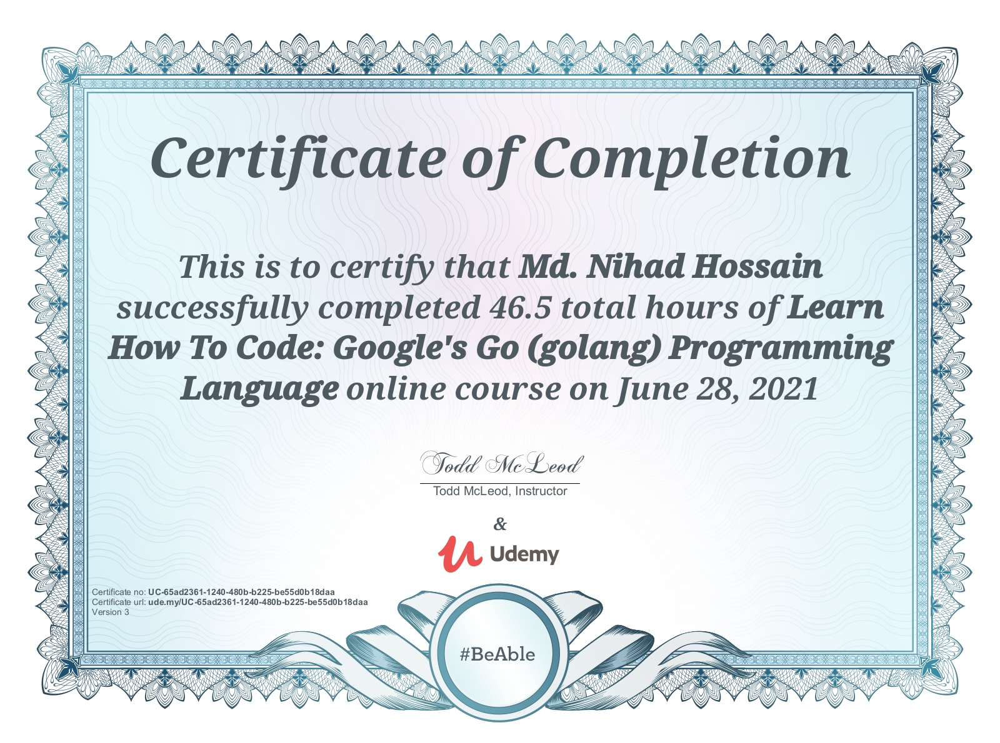

# HonorableTodd_udemy_Golang_practice
# Preferred To anybody :
- [x] **My Learning and Review :**
- This course emphasis me to better skill gained. Really That was an awesome experienced, never been    before. Discuss about every tiny intermediate fundamental things. I really love this course and preferred this course to everyone who want to learn or skilled Google's Golang.
- [x] **Special Thanks to Califonia State University Professor Tood Mcleod**:
- I'm really grateful to Todd Mcleod because he gave me the coupon code for this course on Twitter.
- This course covered another most important topic How to Succeed in Life.
-                                                                   Regrads
                                                               Md. Nihad Hossain
# Course Outline:
- [x] **This is Tood Mcleod course outline.**
- I'm Just share this outline my github ripo.
- [x] **Course Outline Links:**
- https://docs.google.com/document/d/1d6pLCMFyUfrxRlm7Wmh5LJ3yJEPBaygHHvROAwEA-10/edit?usp=sharing

# Completion and certified (Certificate):
- [x] **Persistently,patiently you are bound to succeed and growing mind set, my one of best takeway from this course.**

# Gwowing Mindset and Learning new things from this course :
- [x] **Why golang**
- Take advantage of Multicore.
- Fastest growing and highest paying programming language.
- Invented by 3 geniuses [Rob Pike,Ken Thompson,Robert Geriesemer].
- [x] **How to Succeed in Life?**
- Grit and perseverance -- Angela Lee Duckworth
- Growing mind set and Fixed mindset Theory.
- [x] **Most liked and followed quotes of my teachers**
- Begin with the End In Mind {set goals}
- Put first think first {time on task}
- Persistently,patiently you are bound to succeed.
- Drop by drop  the bucket gets filled.
- [x] **Go Forums**
- https://forum.golangbridge.org/
- [x] **Official Documentation**
- golang spec
- effective go
- [x] **Official Documentation**
- golang spec
- effective go
- [x] **golang.org vs godoc.org**
- golang.org [{About language},{Standard library}]
- godoc.org [{Standard library and Third party packages}]  -[https://pkg.go.dev/]

